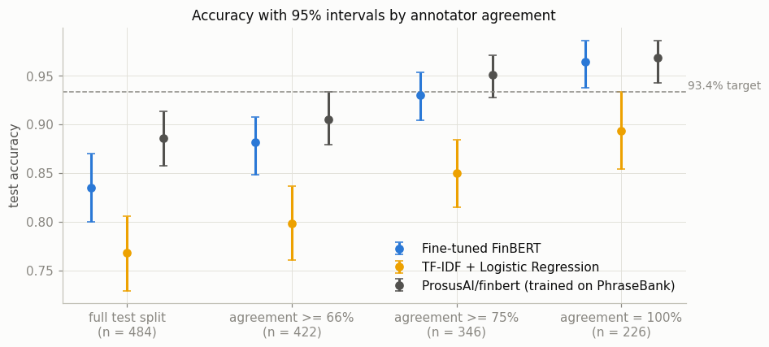
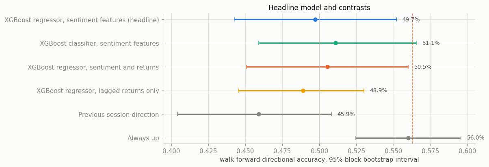
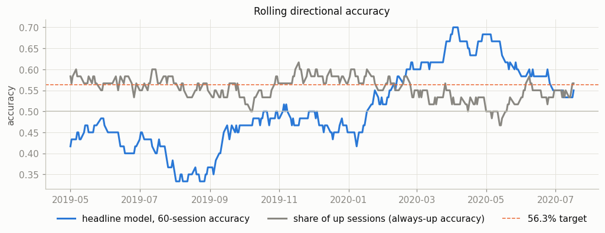

# Financial Sentiment Classification via Fine-tuned FinBERT

A FinBERT model fine-tuned on the Financial PhraseBank and compared with a tuned TF-IDF + Logistic Regression baseline, then applied to 32,692 Reuters headlines whose daily sentiment feeds a walk-forward XGBoost model of the next S&P 500 session's direction. The fine-tuned model is served as an 8-bit ONNX model behind a Flask REST API. Every number below comes from executed Kaggle notebooks, each run twice with identical output.

## Results

### Sentiment classification

FinBERT was fine-tuned on 3,868 Financial PhraseBank sentences with every setting chosen on 484 validation sentences, then scored once on 484 held-out test sentences.

| Benchmark | Scope | Target | Achieved | 95% interval | Status |
|---|---|---|---|---|---|
| Test accuracy | all test sentences | 93.4% | 83.5% | 80.0% to 87.0% | Missed |
| Test macro F1 | all test sentences | 0.91 | 0.822 | 0.783 to 0.859 | Missed |
| Relative accuracy gain over TF-IDF + LR | all test sentences | 19% | 8.6% | 3.1% to 14.4% | Missed |
| Test accuracy | sentences all annotators agreed on | 93.4% | 96.5% | 93.8% to 98.7% | Met |
| Test macro F1 | sentences all annotators agreed on | 0.91 | 0.952 | 0.914 to 0.984 | Met |

| Model | Test accuracy | 95% interval | Macro F1 | 95% interval |
|---|---|---|---|---|
| Fine-tuned FinBERT (headline) | 83.5% | 80.0% to 87.0% | 0.822 | 0.783 to 0.859 |
| TF-IDF + Logistic Regression, tuned | 76.9% | 72.9% to 80.6% | 0.733 | 0.684 to 0.779 |
| ProsusAI/finbert as published (trained on the PhraseBank) | 88.6% | 85.7% to 91.3% | 0.877 | 0.843 to 0.907 |

| Reading of "outperforming the baseline" | Value | 95% interval |
|---|---|---|
| Relative accuracy gain (fixed in advance as the headline) | 8.6% | 3.1% to 14.4% |
| Absolute accuracy gain | 6.6 points | 2.5 to 10.7 points |
| Relative macro F1 gain | 12.2% | 5.4% to 19.8% |
| Absolute macro F1 gain | 0.089 | 0.043 to 0.138 |

| Test sentences | n | Fine-tuned FinBERT | TF-IDF + LR | ProsusAI reference |
|---|---|---|---|---|
| All | 484 | 83.5% | 76.9% | 88.6% |
| Annotator agreement at least 66% | 422 | 88.2% | 79.9% | 90.5% |
| Annotator agreement at least 75% | 346 | 93.1% | 85.0% | 95.1% |
| Annotator agreement 100% | 226 | 96.5% | 89.4% | 96.9% |

What the numbers say:

- FinBERT beats a properly tuned baseline, and the gap is not chance: on the test sentences where exactly one of the two is right, FinBERT wins 65 and the baseline 33 (exact McNemar test, p = 0.0016). The gain is 8.6% relative accuracy, not 19%.
- On all test sentences the 93.4% and 0.91 targets are out of reach: even the upper ends of the intervals (87.0% and 0.859) fall short. They are met on the sentences every annotator agreed on (96.5% and 0.952). That is the same pattern the original FinBERT paper reports, 0.86 accuracy on all of the PhraseBank and 0.97 on its full-agreement subset ([Araci, 2019](https://arxiv.org/abs/1908.10063)).
- The popular `ProsusAI/finbert` checkpoint scores 5 points higher without any training here. Its model card states it was fine-tuned on the Financial PhraseBank, so it has probably seen these test sentences; that is why the headline model starts from a FinBERT that never saw them.
- Three seeds of the chosen configuration score 82.2% to 83.5% on test (mean 82.6%, standard deviation 0.7 points), so the headline seed is not a lucky one.
- Most errors are between neutral and positive: 29 neutral sentences called positive and 30 positive sentences called neutral. Negatives are recognised well (recall 0.85).
- With 484 test sentences each sentence is worth 0.21 points of accuracy, and the intervals resample sentences independently.



### Headline sentiment and the next S&P 500 session

FinBERT scored 32,692 Reuters headlines dated 20 March 2018 to 18 July 2020. Each trading session gets 19 sentiment features from the headlines dated before it, and an XGBoost regressor predicts whether the session closes above its open. The model was tuned once on the first 200 sessions, refitted every 20 sessions on earlier sessions only, and judged on the 366 sessions from 5 February 2019 to 17 July 2020.

| Benchmark | Target | Achieved | 95% interval | Status |
|---|---|---|---|---|
| Directional accuracy | 56.3% | 49.7% (182 of 366) | 44.3% to 55.2% | Missed |
| One-sided binomial p against 0.5 | below 0.01 | 0.56 | | Missed |

| Model, same 366 sessions | Accuracy | 95% interval | Binomial p against 0.5 | p against always up | Pesaran-Timmermann |
|---|---|---|---|---|---|
| XGBoost regressor, sentiment features (headline) | 49.7% | 44.3% to 55.2% | 0.56 | 0.99 | 0.149 (p 0.44) |
| XGBoost classifier, sentiment features | 51.1% | 45.9% to 56.6% | 0.36 | 0.97 | -0.345 (p 0.63) |
| XGBoost regressor, sentiment and lagged returns | 50.5% | 45.1% to 56.0% | 0.44 | 0.98 | 0.325 (p 0.37) |
| XGBoost regressor, lagged returns only | 48.9% | 44.5% to 53.0% | 0.68 | 1.00 | -0.080 (p 0.53) |
| Previous session's direction | 45.9% | 40.4% to 50.8% | 0.95 | 1.00 | -1.874 (p 0.97) |
| Always up | 56.0% | 52.5% to 59.6% | 0.012 | 0.52 | undefined |

What the numbers say:

- No model shows directional skill. The headline model is a coin flip (49.7%, p = 0.56), and the Pesaran-Timmermann test, which asks whether predicted and actual directions are independent, finds no dependence for any model.
- Always predicting up scores 56.0%, because the S&P 500 closed above its open in 56% of these sessions. The resume's 56.3% sits 0.3 points from a rule that uses no information at all, and a binomial test against 0.5 cannot tell the two apart. That is why the comparison with always up and the Pesaran-Timmermann test are reported next to the benchmark test.
- What the model gets right comes from one regime. In February to April 2020, when headline tone collapsed during the COVID crash and intraday moves were large, it is right on 69.4% of 62 sessions; on the other 304 sessions it scores 45.7%.
- 366 test sessions is a short history. Even a model with a true 56.3% accuracy would need 206 correct calls out of 366 to reach p < 0.01.





## How the resume figures map onto the data

- "4.8K annotated sentences": the 50% agreement file has 4,846 lines; 4,836 sentences remain after dropping 2 sentences whose copies carry different labels and collapsing 6 repeats.
- "93.4% accuracy and 0.91 macro F1": measured 83.5% and 0.822 on all test sentences, 96.5% and 0.952 on the sentences every annotator agreed on.
- "outperforming a TF-IDF + Logistic Regression baseline by 19%": read as the relative accuracy gain, fixed before any test result; measured 8.6%. The other three readings are in the table above.
- "8,000+ Reuters financial headlines": 32,692 headlines were scored.
- "next-day S&P 500 return direction": the direction of the next session's open to close return. The headlines carry a date but no time, so a headline dated on a trading day may have appeared after that day's close; predicting from the open of the following session keeps every input before the bell.
- "XGBoost regression model": an XGBoost regressor on that return in percent, with up meaning a prediction of at least zero.
- "56.3% statistically significant directional accuracy (p < 0.01)": measured 49.7%, one-sided exact binomial p = 0.56 against 0.5 over 366 sessions.

Wherever a measured value differs from the resume wording, the measured value is the one to use.

## Live app

[deveshu-finbert-sentiment.onrender.com](https://deveshu-finbert-sentiment.onrender.com)

The app runs on Render's free tier, which puts the service to sleep after 15 minutes without traffic. The first request after a quiet spell can take up to about a minute while it wakes; after that, pages and scoring respond normally.

- **Console**: type one or several sentences and see each one's label and its negative, neutral and positive probabilities. The page opens with an example sentence read by the served model.
- **Model**: the benchmark table, the three models with their intervals, accuracy by annotator agreement, confusion matrices, per-class scores, the three seeds and the 8-bit model against full precision.
- **Market**: the market benchmarks, every model on the same sessions, rolling accuracy, and headline tone next to intraday returns.

The REST API:

```bash
curl -X POST "https://deveshu-finbert-sentiment.onrender.com/api/sentiment" -H "Content-Type: application/json" -d '{"text": "Quarterly revenue rose 12 percent, beating analyst expectations."}'
curl -X POST "https://deveshu-finbert-sentiment.onrender.com/api/sentiment" -H "Content-Type: application/json" -d '{"texts": ["Margins improved.", "The lender raised its loan loss provisions."]}'
curl "https://deveshu-finbert-sentiment.onrender.com/api/market/sessions?start=2020-02-01&end=2020-04-30"
curl "https://deveshu-finbert-sentiment.onrender.com/api/metrics"
```

`/api/sentiment` takes one text or up to 16 texts of at most 2,000 characters and returns each text's label and probabilities with the server time. Each text is scored on its own, so a sentence gets the same probabilities whatever it is sent with. The served model is the fine-tuned FinBERT quantised to 8-bit integers: 82.9% test accuracy against 83.5% at full precision, with 3 of 484 test labels changed. Measured locally with the real files, one text takes 40 ms at the median and 51 ms at the 95th percentile, 16 texts take 731 ms, and the loaded app uses 203 MB of memory. The free Render instance has only a fraction of a CPU, so expect slower responses there.

## Pipeline

```
PhraseBank (Kaggle)      Reuters headlines (Kaggle)      S&P 500 prices (Kaggle)
       |                            |                              |
  01-eda               all three sources, analysis only
       |
  02-data-baseline     clean table, fixed split, tuned TF-IDF + Logistic Regression
       |
  03-finetune [GPU]    20-trial search, three seeds, headline model, ProsusAI reference
       |
  04-evaluation        the single test evaluation
       |
  05-headline-scoring  every Reuters headline scored in float64
       |
  06-market-model      session features, walk-forward XGBoost, significance tests
       |
  07-export            ONNX export, 8-bit quantisation, serving bundle
       |
  private Hugging Face model repo --> Render (Docker, Flask, gunicorn)
```

Each notebook runs on Kaggle and reads earlier notebooks' outputs as data sources. The executed notebooks, with outputs, are in `notebooks/`.

| Notebook | What it does | Kaggle runtime (two runs) |
|---|---|---|
| 01 EDA | Subset sizes, duplicates, headline coverage, S&P 500 returns, the walk-forward test size | under 1 minute |
| 02 Data and baseline | Clean table, stratified split, 144-configuration grid search for the baseline | about 4 minutes |
| 03 Fine-tuning | 20-trial Optuna search over two checkpoints, three seeds, ProsusAI reference (T4 GPU) | 66 to 70 minutes |
| 04 Evaluation | Every test metric, bootstrap intervals, McNemar test, agreement slices, benchmarks | under 1 minute |
| 05 Headline scoring | 32,692 headlines scored in float64 on CPU | 21 to 25 minutes |
| 06 Market model | Session features, tuning on the first 200 sessions, walk-forward, tests | about 1 minute |
| 07 Export | ONNX export and parity check, 8-bit quantisation and its cost, serving bundle | about 6 minutes |

## Why seven chained notebooks instead of one

Fine-tuning is the only stage that needs a GPU, and Kaggle's GPU time is rationed. Chaining writes the fine-tuned model once; evaluation, headline scoring, the market model and the export then read it as an input, so a bug in any of them never costs another hour of GPU time, and each stage reruns alone from its predecessors' saved outputs. Splitting the work also keeps each notebook short enough to read as one argument, with every code cell between a markdown cell that states what it does and why, and one that states the conclusion drawn from its output.

## Design decisions

**A FinBERT that never saw the test sentences.** The search chose between two checkpoints from Yang, Uy and Huang: `finbert-pretrain`, pretrained on 4.9 billion tokens of filings, earnings calls and analyst reports, and `finbert-tone`, the same model fine-tuned on analyst-report sentences. Neither has seen the PhraseBank. `ProsusAI/finbert` was trained on it, so it appears only as a labelled reference.

**The split and the agreement slices.** The 50% agreement file supplies all 4.8K sentences. The split is 80/10/10, stratified on label and agreement level, so every split has the same mix of easy and contested sentences. The slices by agreement were declared before any test result, because accuracy on the PhraseBank depends heavily on how ambiguous the sentences are.

**A baseline given a real search.** The TF-IDF + Logistic Regression baseline got a 144-configuration grid search with 5-fold cross-validation on the training sentences (word n-grams, sublinear term frequency, minimum document frequency, regularisation, class weights). A weak baseline would make the comparison meaningless.

**Choices made on validation only.** The fine-tuning search (checkpoint, learning rate, epochs, warmup, weight decay, batch size; 20 trials) scored validation accuracy. The best configuration was retrained with three seeds, and the rule fixed in advance picked the seed with the best validation accuracy. The test sentences were scored once, in notebook 4.

**Identical results on a GPU.** Fine-tuning ran with PyTorch's deterministic algorithms, deterministic cuBLAS workspaces, TF32 off, eager attention and one T4. Before any long run, two smoke runs had to produce byte-identical validation logits; they did, and the 70-minute run then reproduced itself exactly. Headline scoring runs in float64 on CPU, because Kaggle assigns Intel and AMD machines at random and their float32 arithmetic rounds differently.

**Predicting from the next open.** A headline dated d feeds the first session after d, and the target is that session's open to close return. Headline dates carry no time of day, so a target that starts at the next open is the earliest one for which every input is certain to come first.

**A walk-forward and its power.** The market model was tuned once on the first 200 eligible sessions and refitted every 20 sessions on everything before, so no prediction uses later data. That leaves 366 test sessions; notebook 1 computed before any modelling that 206 correct calls would be needed for p < 0.01.

**Tests that can tell skill from drift.** The benchmark test, fixed in advance, is a one-sided exact binomial test against 0.5. In a rising market a model that always says up passes it, so the README also reports the binomial test against always up, the Pesaran-Timmermann test and a block bootstrap interval, together with five contrasts on the same sessions.

**Sentiment-only headline model.** The headline model uses only the 19 sentiment features, which is what the claim is about. Models with lagged returns, a classifier and two naive rules run beside it so the reader can see whether sentiment adds anything; here none of them does.

**An 8-bit model that fits a free server.** Full-precision FinBERT is about 440 MB of weights and would not fit Render's 512 MB next to PyTorch. Notebook 7 exports it to ONNX, checks every logit against PyTorch (within 1e-4 on all 484 test sentences), and quantises the weights to unsigned 8-bit integers with ONNX Runtime: 110.5 MB, 0.6 points of test accuracy. The app runs it with ONNX Runtime and the tokenizers library, without PyTorch. Dynamic quantisation computes one activation scale per tensor, so the app and the notebook score every text on its own; a test requires the app to reproduce the notebook's probabilities for 20 sentences within 1e-4 (the largest difference is 5e-9).

**Licence handling.** The app and its files carry no dataset text: example sentences were written for this project, and the market page shows only daily aggregates. The notebooks print at most five attributed examples per dataset.

**Two runs per notebook.** The Kaggle CLI returns only printed output and saved files, so every notebook prints the numbers its conclusions rely on and saves its figures. A first run produced them, the conclusions were written from them, and a final run reproduced the first line for line.

## Reproduce

1. Authenticate the Kaggle CLI on a phone-verified account (needed for the GPU and for internet access in notebooks 03 and 07).
2. Create a Python 3.12 virtual environment and install `requirements-dev.txt`.
3. In each `notebooks/*/kernel-metadata.json`, replace the username in `id` and `kernel_sources` with your own.
4. Push and run the notebooks in order with the helper, waiting for each to finish:
   ```bash
   python scripts/run_notebook.py push 02-data-baseline
   ```
   `wait`, `fetch` and `compare` follow the same pattern, and `push --smoke` runs a quick check first. Notebook 03 needs a GPU session.
5. Copy notebook 07's `artifacts/` folder into `app/artifacts/` and run the tests:
   ```bash
   python -m pytest
   ```
6. Run the app locally:
   ```bash
   python -m flask --app "app/server.py:create_app()" run --port 7873
   ```

To deploy, upload the bundle to a private Hugging Face model repo with `scripts/upload_artifacts.py`, create a Render Blueprint from `render.yaml`, and set `HF_TOKEN` to a read token in Render's environment settings.

## Repository layout

```
notebooks/   seven executed Kaggle notebooks and their kernel metadata
app/         Flask app: server, artifact loading, ONNX sentiment model, market data, templates, static files, Dockerfile
tests/       unit and API tests on a synthetic bundle; real-artifact checks run when the bundle is present
scripts/     Kaggle notebook runner and artifact upload
assets/      figures used in this README
render.yaml  Render deployment blueprint
```

## Data, models and licences

None of the data is redistributed in this repository; the notebooks read it on Kaggle.

1. Financial PhraseBank v1.0: P. Malo, A. Sinha, P. Korhonen, J. Wallenius, P. Takala, "Good debt or bad debt: Detecting semantic orientations in economic texts", Journal of the Association for Information Science and Technology 65(4), 2014. Licensed CC BY-NC-SA 3.0; read from the Kaggle dataset [ankurzing/sentiment-analysis-for-financial-news](https://www.kaggle.com/datasets/ankurzing/sentiment-analysis-for-financial-news).
2. Reuters headlines from the Kaggle dataset [notlucasp/financial-news-headlines](https://www.kaggle.com/datasets/notlucasp/financial-news-headlines), used only as daily aggregates.
3. S&P 500 (^GSPC) daily prices from Yahoo Finance via the Kaggle dataset [paveljurke/s-and-p-500-gspc-historical-data](https://www.kaggle.com/datasets/paveljurke/s-and-p-500-gspc-historical-data), CC0.
4. FinBERT checkpoints `yiyanghkust/finbert-pretrain` and `yiyanghkust/finbert-tone`: Y. Yang, M. C. S. Uy, A. Huang, "FinBERT: A Pretrained Language Model for Financial Communications", arXiv:2006.08097, 2020; A. H. Huang, H. Wang, Y. Yang, "FinBERT: A Large Language Model for Extracting Information from Financial Text", Contemporary Accounting Research, 2022.
5. `ProsusAI/finbert`: D. Araci, "FinBERT: Financial Sentiment Analysis with Pre-trained Language Models", arXiv:1908.10063, 2019.
6. M. H. Pesaran, A. Timmermann, "A Simple Nonparametric Test of Predictive Performance", Journal of Business and Economic Statistics 10(4), 1992.
